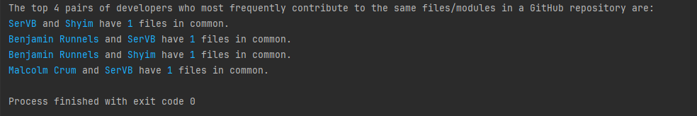

# JetbrainsCouplingAnalysis
A CLI tool to calculate the pairs of developers who most frequently contribute to the same files/modules in a GitHub repository as part of an internship application.

## How to Run the GitHub Repository Analysis Tool

This tool analyzes a GitHub repository and identifies the pairs of developers who most frequently contribute to the same files. 
Follow the steps below to run this tool.

### Prerequisites

- Python 3 installed on your machine.
- Access to the internet to fetch data from the GitHub API (might need to log in for a higher limit of API requests).

### Steps

1. **Clone the repository**:

   Open a terminal and run the following command:

   ```bash
   git clone [https://github.com/yourusername/yourrepository.git](https://github.com/alouiii/JetbrainsCouplingAnalysis.git)

2. **Navigate to the directory**:

    ```bash
    cd JetbrainsCouplingAnalysis

3. **Run the script**:

    Run the following command in your terminal:
    ```bash
    python best_partners.py [owner/repo]
    ```

    where `owner/repo` stands for the repo you want to check.


### Output

This is an example of an output result when running the tool with a given repo:


